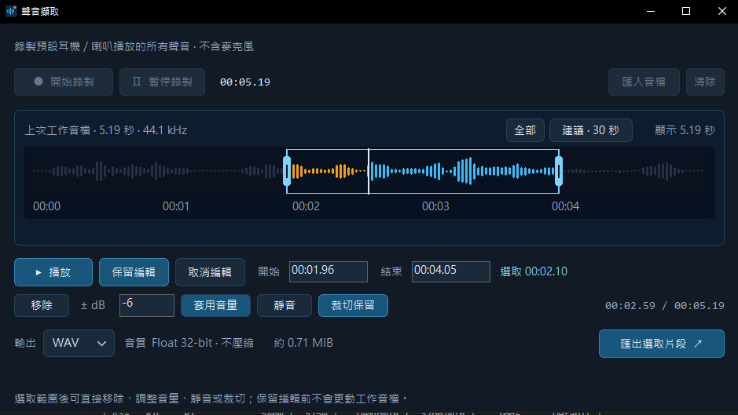

# Voice Capture Lite｜輕量聲音擷取與編輯

**原生 C++，單一 EXE 約 0.61 MiB（638,464 bytes）。** 下載即可執行，免安裝，不需額外安裝執行環境或 FFmpeg。

錄下 Windows 耳機／喇叭正在播放的聲音，或匯入 WAV／MP3，在波形上播放、選取、編輯並匯出。

## 下載

[下載 EXE](https://github.com/g114056175/VoiceCapture/releases/download/v3.0.2/VoiceCaptureLiteNative-edit-session.exe) · [原始碼 ZIP](https://github.com/g114056175/VoiceCapture/archive/refs/tags/v3.0.2.zip) · [SHA-256](https://github.com/g114056175/VoiceCapture/releases/download/v3.0.2/VoiceCaptureLiteNative-edit-session-SHA256SUMS.txt)

適用 Windows 10／11 x64，需可用的播放裝置與 Windows 媒體元件。EXE 尚未簽章。

## 錄製與播放


按「開始錄製」擷取系統播放聲音，可暫停／繼續；完成後按「結束錄製」。也可「匯入音檔」或拖入 WAV／MP3。點擊波形跳轉，按「播放」試聽；拖曳底部刻度縮放時間軸，「全部」可回到完整音檔。

## 編輯音檔



按「編輯」，拖曳波形左右把手，或輸入開始／結束時間：

- **移除**：刪除選取區段，銜接前後音訊。
- **套用音量**：調整 −60～+24 dB；負值降低、正值提高。
- **靜音**：讓選取區段無聲，保持時長。
- **裁切保留**：只留下選取區段。

操作先套用到編輯副本。「保留編輯」儲存完整編輯結果；「取消編輯」捨棄本次全部修改。匯入的原始檔不受影響；目前沒有逐步復原。

## 匯出

選擇 WAV（不壓縮，保留工作音檔的 PCM16／float32 格式）或 MP3（128／192／320 kbps）。編輯模式可直接「匯出選取片段」；保留編輯後可匯出完整結果。

## 原始碼與建置

[`native/`](native/) 使用 Win32、WASAPI 與 Media Foundation，採靜態連結 C++ 執行環境。建置需要 Windows x64 與 LLVM-MinGW：

```powershell
./native/build.ps1
```

輸出：`native/dist/VoiceCaptureLiteNative.exe`。測試與技術說明見 [native/README.md](native/README.md)。

程式不主動錄製麥克風；支援的 Windows 可擷取指定程序與子程序，並非單一瀏覽器分頁。Windows 11 指定程序錄音尚待實機驗證。專案目前未指定原始碼授權。
