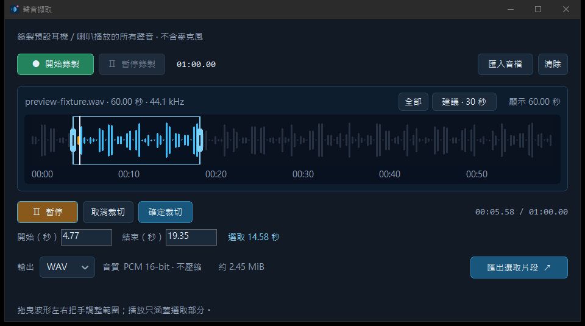
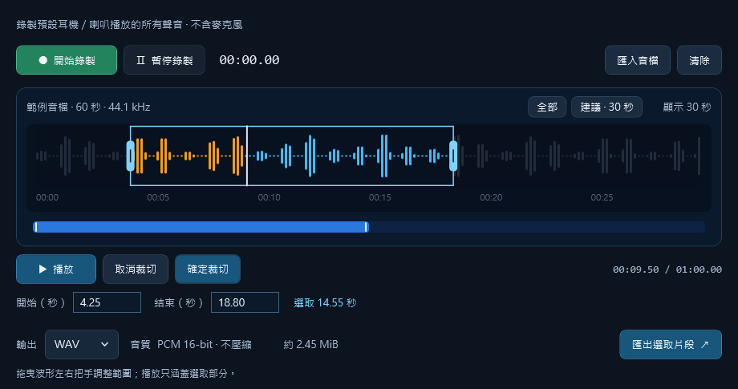

# Voice Capture Lite｜Windows 聲音擷取工具

不用下載整部影片，就能錄下 Windows 預設耳機／喇叭正在播放的聲音；也可以匯入 WAV／MP3，直接在波形上預覽、播放、裁切並匯出。程式不會主動錄麥克風。支援的 Windows 版本才會顯示「指定視窗的音訊」選項；實際擷取範圍是該程序與子程序，並非單一瀏覽器分頁。

## 下載

一般使用者選原生版，下載後直接執行，不需要安裝 C++、Python、.NET 或 FFmpeg。

| 版本 | 檔案 | 大小 |
| --- | --- | ---: |
| 原生 C++ v3.0.2（建議） | [EXE](https://github.com/g114056175/VoiceCapture/releases/download/v3.0.2/VoiceCaptureLiteNative-v3.0.2-win-x64.exe) · [ZIP](https://github.com/g114056175/VoiceCapture/releases/download/v3.0.2/VoiceCaptureLiteNative-v3.0.2-win-x64.zip) | EXE 約 0.59 MiB |
| WPF/.NET v2.2.1 | [自含執行環境 EXE](https://github.com/g114056175/VoiceCapture/releases/download/v3.0.2/VoiceCaptureLiteWPF-v2.2.1-win-x64.exe) | 約 63.26 MiB |
| 兩版一起下載 | [整合 ZIP](https://github.com/g114056175/VoiceCapture/releases/download/v3.0.2/VoiceCaptureLite-Windows-v3.0.2-2.2.1.zip) | 約 58.91 MiB |

適用 Windows 10／11 x64，需有可用播放裝置與 Windows 媒體元件。ZIP 先解壓再執行；EXE 尚未簽章，請只從本儲存庫的 Release 下載，不需停用防毒或系統保護。

## 畫面

原生版：

WPF 版：

## 快速使用

1. 按「開始錄製」，播放想保留的聲音，再按「結束錄製」；或直接匯入 WAV／MP3。
2. 在波形上點擊可跳轉，按「播放」試聽。拖動波形底部的時間刻度可縮放顯示範圍；「全部」與「建議 · 30 秒」可快速切換。放大時可用底部比例導航條平移。
3. 按「裁切」，拖曳左右把手。框外內容不會播放或匯出；「取消裁切」保留原音檔，「確定裁切」經確認後才覆寫暫存工作檔。
4. 匯出 WAV（不壓縮）或 MP3（128／192／320 kbps）。原生版相容裝置可保留原生 44.1／48 kHz PCM16 或 float32 WAV。

兩版均將計時顯示為兩位小數、限制最低可用視窗大小，且波形卡片高度不再單獨拖曳。錄音封包依 [WASAPI 裝置樣本位置](https://learn.microsoft.com/en-us/windows/win32/api/audioclient/nf-audioclient-iaudiocaptureclient-getbuffer)接續，避免逐包時間戳抖動造成補零或丟樣本；這不是自動降噪，原始來源已有的噪聲仍可能被錄下。

## 原始碼

- [`native/`](native/)：Win32／WASAPI／Media Foundation 自繪 C++ 版。Windows x64 安裝 LLVM-MinGW 後執行 `native/build.ps1`、`native/tests/run.ps1`。
- [`wpf/`](wpf/)：.NET 8 WPF 版。安裝 .NET 8 SDK 後執行 `wpf/build.ps1 -Portable`、`wpf/verify.ps1 -Audio -Capture`。

本次在 Windows 10 build 19045 驗證了兩版的錄音、播放、裁切、WAV／MP3 與縮小視窗的介面。Windows 11 指定程序錄音尚待實機驗證。專案目前**尚未選定原始碼授權**；公開可見不代表已授予修改或再散布權利。WPF 自含執行環境的第三方授權告知見 [`wpf/notices/`](wpf/notices/)。
