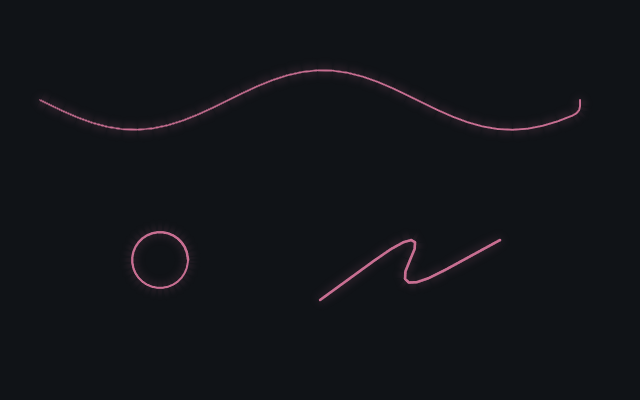
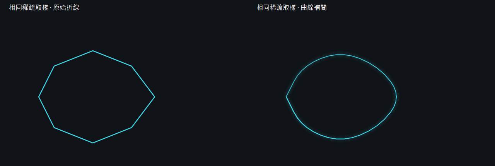
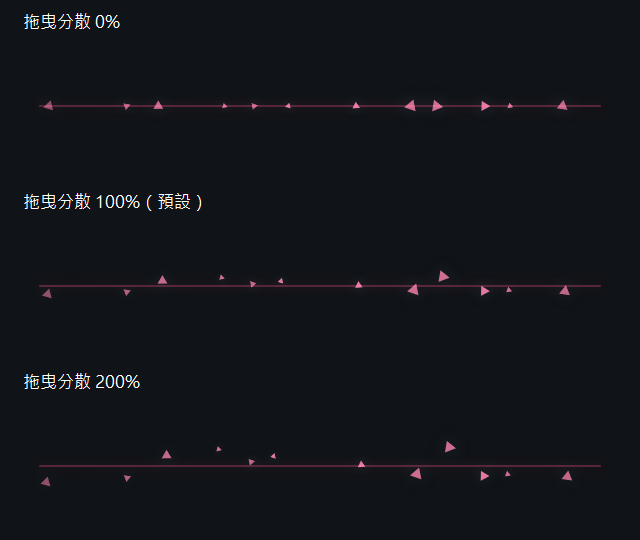

# 滑鼠光跡

Windows 桌面滑鼠裝飾：按住左鍵拖曳出現光跡，點擊產生波紋與碎片。

## 下載

**[下載 EXE](https://github.com/g114056175/my_tools/releases/download/cursor-effects/BlueArchiveCursor.exe)**

Windows 防護可能阻擋下載或執行，原因尚未確認。

適用 **Windows 10（1703 以上）／Windows 11 x64**，需 .NET Framework 4.8 與支援 Direct3D 11 的顯示驅動；已在 Windows 10 22H2 測試。

## 效果預覽


## 操作

- 開關控制整體效果；效果顯示在最上層，不阻擋滑鼠操作。
- 「拖曳光跡」「點擊效果」「碎片」分頁調整顏色、大小、不透明度、數量、速度與光暈，或直接選用配色模板。
- 最小化回工作列；「收起面板」藏到托盤，雙擊托盤叫回；X 退出。「重設」還原外觀。

## 大小與效能

**EXE：105 KiB**；首次執行另釋出約 **19 KiB** 原生 DLL。

測試電腦：**i5-12600K、RTX 4060、Windows 10 22H2**，桌面範圍 3840×1080。

| 狀態 | CPU | 記憶體（工作集） |
| --- | ---: | ---: |
| 背景常駐、無操作 | 約 0–0.03% | 約 74–82 MiB |
| 持續播放預設效果 | 約 0.13% | 約 79 MiB |
| 全部大小、分散、速度、碎片與光暈 300%，衰退 1000 ms | 約 0.11% | 約 81 MiB |
| 跨桌面高速拖曳，碎片／光暈 300% | 約 0.50% | 約 82 MiB |

效果固定 60 FPS，結束後停止繪製。以上為收起面板、每階段 6 秒的短時量測；CPU 按 16 邏輯執行緒折算，未包含桌面合成器（DWM）。約 0% 為短測的計時精度，不代表完全零負載；不同電腦與測量時段會有差異。

## 參考

根據《蔚藍檔案》遊戲內的鼠標粒子效果嘗試模擬，為非官方工具。

<details>
<summary><strong>建置、驗證與技術細節（點此展開）</strong></summary>

### 技術

C#／WinForms 控制面板，C++／Direct2D + DirectComposition 繪製。只繪製效果附近的小區域，閒置時停止渲染；圖片與原生模組內嵌於 EXE。GPU 不可用時退回 WARP 軟體繪圖。

高速拖曳時連接取樣點，轉折使用輕量二次曲線補間；不增加滑鼠輪詢頻率，也不延遲最新端點。曲線頂點與存活碎片數量均有上限。停頓後續接原位置，放開滑鼠或進入控制面板時結束該段。

「碎片 → 拖曳分散 %」可調 0–300%，預設 100%：碎片從軌跡附近生成，再以隨機方向與速度散開；不再預先放到兩側的距離帶。0% 貼合路徑，不影響數量或點擊波紋。每顆碎片具有不同初始明暗並平順淡出，亂數不會每幀重新抽取。

「周圍光暈 %」控制光跡、點擊波紋與碎片周圍的柔光，0% 關閉柔光，本體仍保留；不改變碎片數量、大小或分散距離。櫻花紅模板使用較鮮明的紅粉光跡與粉色碎片。

「拖曳光跡 → 衰退時間 ms」可調 40–1000 毫秒，預設 **180 毫秒**；僅控制光跡，碎片仍使用自己的速度設定。設定會自動儲存，「重設」還原預設外觀。

光跡與光暈使用 Direct2D MAX 混合，避免接點、急彎與重疊處反覆累積亮度；點擊波紋與碎片維持原混合方式。不增加離屏紋理或逐幀模糊運算。







設定及原生 DLL 快取位於 `%LOCALAPPDATA%\BlueArchiveCursor.Native`。碎片速度改變移動與淡出時間，飛散範圍不變；0% 停止移動但仍淡出。程式僅允許一個實例，再次執行會叫回面板。

發布前以 `tests/security-scan.ps1` 掃描實際 EXE；`release.ps1` 在偵測到威脅、掃描失敗或檔案被隔離時停止。此檢查不代表微軟已完成覆核。

Windows 版本下限依據所用的 [DPI API](https://learn.microsoft.com/en-us/windows/win32/api/winuser/nf-winuser-setprocessdpiawarenesscontext)。Windows 11 尚未實機驗證。第三方聲明見 [THIRD_PARTY_NOTICES.md](THIRD_PARTY_NOTICES.md)。

### 建置

在 Windows PowerShell 5.1 進入專案根目錄。需系統 .NET Framework C# compiler 與固定版本的 [LLVM-MinGW 20260616／Clang 22.1.8，x64 UCRT](https://github.com/mstorsjo/llvm-mingw/releases/tag/20260616)：

```powershell
# PATH 已有同版 LLVM-MinGW 時，可略過工具鏈下載
powershell -NoProfile -ExecutionPolicy Bypass -File tools/setup-toolchain.ps1
powershell -NoProfile -ExecutionPolicy Bypass -File build.ps1
powershell -NoProfile -ExecutionPolicy Bypass -File release.ps1
```

工具鏈下載約 179 MiB，僅供建置；版本、網址與 SHA-256 在 `toolchain.json`。可使用 `build.ps1 -Compiler "完整路徑\clang++.exe"` 指定同版編譯器。無須 Visual Studio、Node 或 Python。

- `dist/`：EXE、說明與效果圖。
- `dist/BlueArchiveCursor.exe`：發布用單檔 EXE。
- `.build/build-info.json`：編譯器版本及來源／產物雜湊。

可重建功能相同的程式，不保證 EXE 位元組完全一致。下載的工具鏈、產物與測試結果已列入 `.gitignore`。

### 驗證

```powershell
powershell -NoProfile -ExecutionPolicy Bypass -File tests/verify.ps1
powershell -NoProfile -ExecutionPolicy Bypass -File tests/release-smoke.ps1
powershell -NoProfile -ExecutionPolicy Bypass -File tests/performance.ps1
```

圖形驗證需要互動桌面與硬體 GPU；單檔啟動驗證前先退出正在執行的程式。結果寫入 `test-results/`；效能測試只統計本程式，使用內部測試座標，不操作系統滑鼠。

</details>
