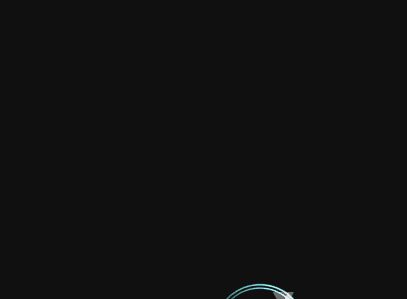
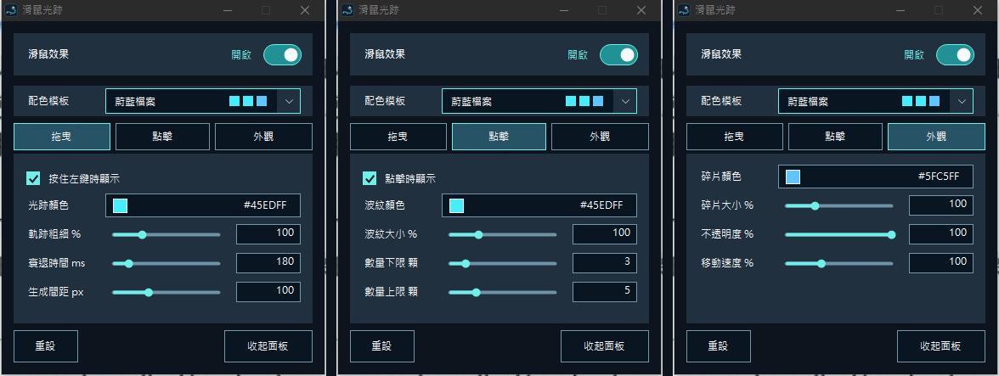
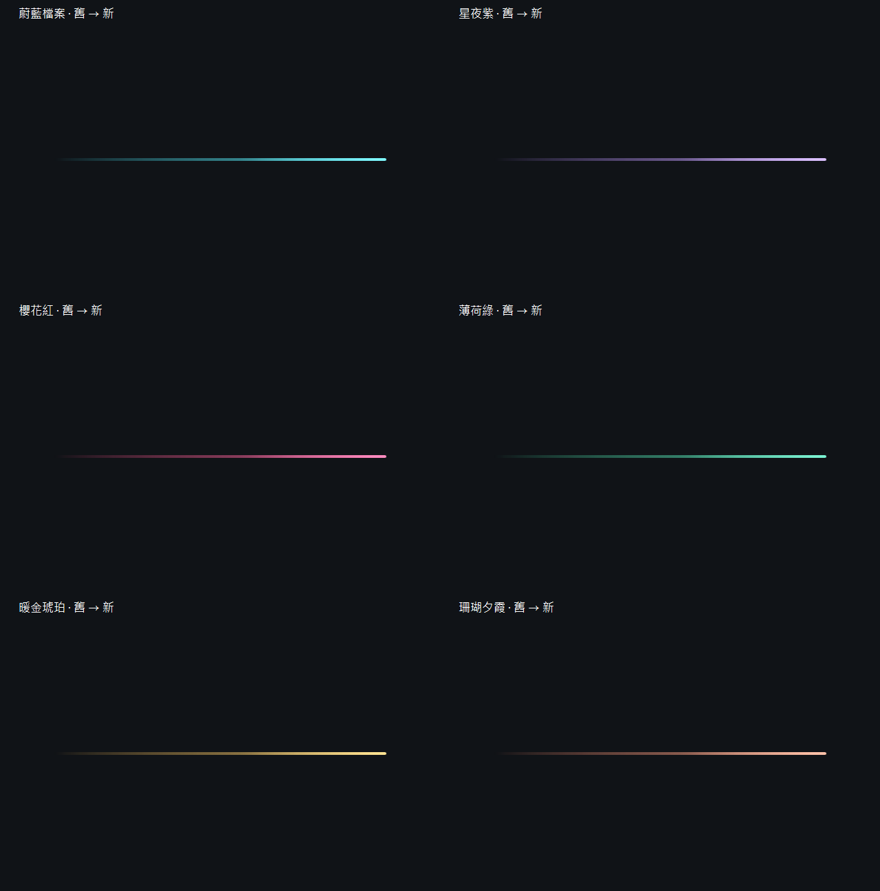
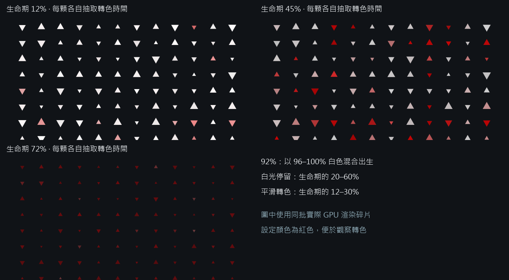
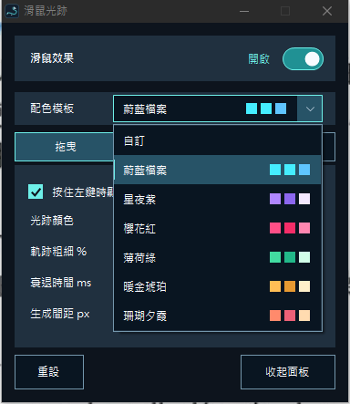
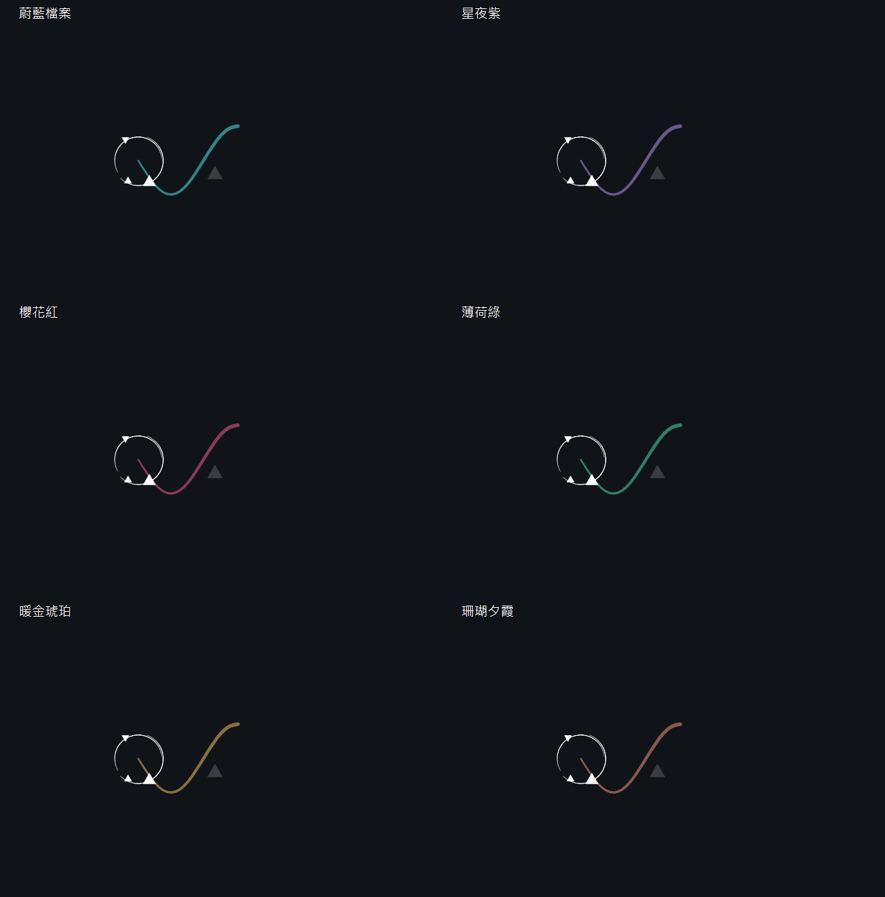
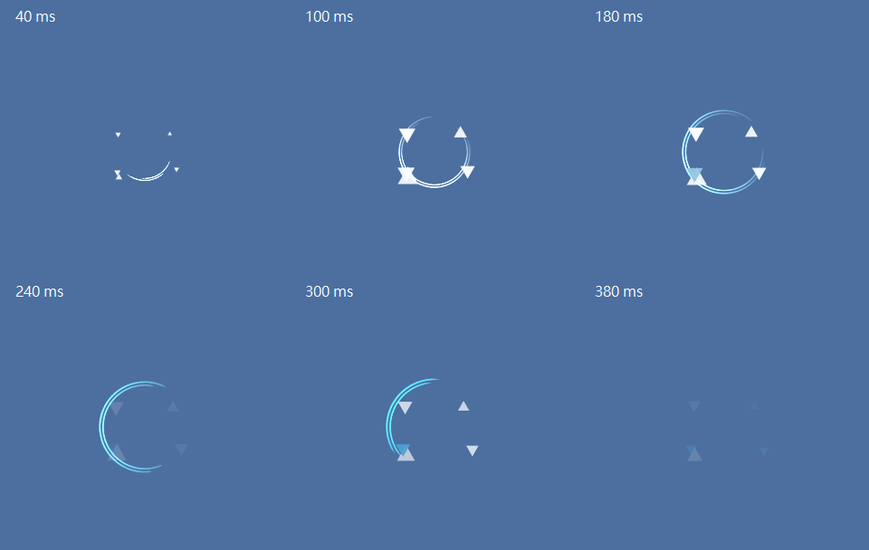

# 滑鼠光跡

Windows 桌面滑鼠裝飾：按住左鍵拖曳出現光跡，點擊產生波紋與碎片。

## 下載

**[下載 EXE](https://github.com/g114056175/my_tools/releases/download/cursor-effects/BlueArchiveCursor.exe)**

Windows 防護可能阻擋下載或執行，原因尚未確認。

適用 **Windows 10（1703 以上）／Windows 11 x64**，需 .NET Framework 4.8 與支援 Direct3D 11 的顯示驅動；已在 Windows 10 22H2 測試。

## 效果預覽





## 操作

- 只有右上開關按鈕切換整體效果，旁邊文字不互動；效果顯示在最上層，不阻擋滑鼠操作。
- 「拖曳」調整光跡顏色、粗細、衰退時間與碎片間距；預設衰退 **180 ms**、間距 **100 px**。
- 「點擊」調整波紋顏色、大小與碎片數量上下限；預設每次隨機 **3–5 顆**，上下限都設為 0 可關閉點擊碎片。
- 「外觀」共用碎片顏色、大小、速度與不透明度；點擊與拖曳使用相同碎片大小。也可直接選配色模板。
- 粗細、碎片與波紋的預設欄位均為 **100%**；實際基準分別是調整前的 **200%、200%、75%**。
- 數值可輸入或拖動滑條。最小化回工作列；「收起面板」藏到托盤，雙擊托盤叫回；X 退出。「重設」還原外觀。

## 大小與效能

**EXE：103.5 KiB（105,984 bytes）**；首次執行另釋出約 **21 KiB** 原生 DLL，使用者只需下載 EXE。

測試電腦：**i5-12600K、RTX 4060、Windows 10 22H2**，桌面範圍 3840×1080。

| 狀態 | CPU | 記憶體（工作集） |
| --- | ---: | ---: |
| 啟動後閒置 | 低於 0.1% | 約 75 MiB |
| 持續播放預設效果 | 約 0.07% | 約 85 MiB |
| 間距 8 px、每次點擊 18–20 顆、大小／速度 300%、衰退 1000 ms | 低於 0.1% | 約 86 MiB |
| 每 16 ms 跨桌面跳動，間距 8 px | 約 0.32% | 約 88 MiB |

效果固定 60 FPS，結束後停止繪製。預設效果 GPU 引擎讀值約 0–1%，上述極端跳動最高約 3%；壓力測試後閒置工作集可能維持約 88 MiB。

以上為收起面板、每階段 6 秒的短時量測；CPU 按 16 邏輯執行緒折算，低讀值受計時精度影響，未包含桌面合成器（DWM）。預設效果每幀 CPU 送出平均約 0.59 ms，幀間隔第 95 百分位約 17.4 ms，並非滑鼠到顯示的端到端延遲。不同電腦與測量時段會有差異。

## 參考

根據《蔚藍檔案》遊戲內的鼠標粒子效果嘗試模擬，為非官方工具。

<details>
<summary><strong>建置、驗證與技術細節（點此展開）</strong></summary>

### 技術

C#／WinForms 控制面板，C++／Direct2D + DirectComposition 繪製。只繪製效果附近的小區域，閒置時停止渲染；原生模組內嵌於 EXE。GPU 不可用時退回 WARP 軟體繪圖。

高速拖曳時連接取樣點，轉折使用輕量二次曲線補間；不增加滑鼠輪詢頻率，也不延遲最新端點。曲線頂點與存活碎片數量均有上限。停頓後續接原位置，放開滑鼠或進入控制面板時結束該段。光跡使用 Direct2D MAX 混合，避免接點、急彎與重疊處累積亮度。


光跡參照原 `FX_MAT_TouchFXTrail` 的 RGB 漸層（亮藍 → 暗藍 → 黑色）。原材質 HDR 倍率約 24，使用 One/One 加亮混合；獨立 alpha keys 保持 1，消失主要來自 RGB 降至黑色。這和點擊波紋的裁切 shader 不同，證據見 [trail-reference.json](tests/trail-reference.json)。

桌面版將漸層的主亮度曲線套用到所有模板，以點的存活比例映射，並用 `f(x)=1.6x/(0.6+x)` 將光強映射到 SDR。顏色與透明度只套用一次，避免留下黑色不透明尾端。33 個漸層取樣與 brush 只在換色時重建；保留 MAX 混合以避免接點變亮。僅繪製光跡、波紋與三角形本體，沒有柔光貼圖、模糊或 Bloom。



拖曳碎片依累積位移生成，間距隨機浮動 ±35%；停止移動不生成，間距 0 關閉拖曳碎片。兩側生成位置保留小段空隙，再輕微向外漂移。跨螢幕的極端跳躍另有每次生成上限。

點擊雙環參照 Shittim 的薄環網格粒子：生命期 600 ms、隨機大小與獨立旋轉，使用原 Hermite 成長曲線展開。已讀出原 D3D11 編譯 shader 的核心裁切公式：

```text
alpha = maskAlpha × mainAlpha × particleAlpha
alpha < customThreshold 時，裁掉該像素
```

customThreshold 使用原時間曲線 1 → 0 → 1；角度與徑向透明度由原貼圖的數值取樣重建，兩個獨立旋轉的薄環各自留下不同弧段，不使用人工安排的多缺口模板。原 shader 使用一般透明混合。證據與數值見 [shader-reference.json](tests/shader-reference.json)、[reference-profile.json](tests/reference-profile.json)。

Direct2D 以小尺寸環形快取、ColorMatrix 與 ArithmeticComposite 計算裁切，透明度只套用一次；ColorMatrix 的預乘處理由 [Microsoft 文件](https://learn.microsoft.com/en-us/windows/win32/direct2d/color-matrix)說明。

螢幕像素比例尚未取得，環寬使用 0.55 倍校準；SDR 材質亮度採 1.8 倍校準。亮度與短暫閃光經桌面外觀校準，不重現 Unity HDR／Bloom，不能宣稱逐像素一致。不附帶解包貼圖、模型、shader 二進位或 Unity 檔案。

點擊碎片數量在設定上下限之間抽取整數，限制 0–20 顆；預設半徑約 37.5 px、散布 35%，角度獨立抽取，保留自然聚集與空白。碎片固定朝上或朝下，先長大再向自身中心縮小，出生時偏白，隨後轉為設定顏色並依明暗曲線消散。

碎片出生時有 92% 機率混合 96–100% 白色，其餘混合 40–75% 白色。每顆各自抽取白光停留時間（生命期的 20–60%）與平滑轉色時間（12–30%），出生後不重抽，不依距離游標遠近決定亮白程度。這些是固定的外觀校準區間，並非已確認的官方精確值。



「外觀」統一點擊與拖曳碎片大小、速度及不透明度。速度改變移動與淡出時間，飛散範圍不變；0% 停止移動但仍淡出。設定不提供柔光，舊設定中的柔光數值也不生效。







設定及原生 DLL 快取位於 `%LOCALAPPDATA%\BlueArchiveCursor.Native`。設定自動儲存，舊欄位會遷移至目前共用設定。程式只允許一個實例，再次執行叫回面板。

發布前以 `tests/security-scan.ps1` 掃描實際 EXE；`release.ps1` 在偵測到威脅、掃描失敗或檔案被隔離時停止。此檢查不代表微軟已完成覆核。

Windows 版本下限依據所用的 [DPI API](https://learn.microsoft.com/en-us/windows/win32/api/winuser/nf-winuser-setprocessdpiawarenesscontext)。Windows 11 尚未實機驗證。第三方聲明見 [THIRD_PARTY_NOTICES.md](THIRD_PARTY_NOTICES.md)。

### 建置

在 Windows PowerShell 5.1 進入專案根目錄。需系統 .NET Framework C# compiler 與固定版本的 [LLVM-MinGW 20260616／Clang 22.1.8，x64 UCRT](https://github.com/mstorsjo/llvm-mingw/releases/tag/20260616)：

```powershell
# PATH 已有同版 LLVM-MinGW 時，可略過工具鏈下載
powershell -NoProfile -ExecutionPolicy Bypass -File tools/setup-toolchain.ps1
powershell -NoProfile -ExecutionPolicy Bypass -File build.ps1
powershell -NoProfile -ExecutionPolicy Bypass -File release.ps1
```

工具鏈下載約 179 MiB，僅供建置；版本、網址與 SHA-256 在 `toolchain.json`。可用 `build.ps1 -Compiler "完整路徑\clang++.exe"` 指定同版編譯器。無須 Visual Studio、Node 或 Python。

- `dist/BlueArchiveCursor.exe`：單檔 EXE。
- `dist/`：程式、說明與效果圖。
- `.build/build-info.json`：編譯器版本及來源／產物雜湊。

可重建功能相同的程式，不保證 EXE 位元組完全一致。下載的工具鏈、產物與測試結果已列入 `.gitignore`。

### 驗證

```powershell
powershell -NoProfile -ExecutionPolicy Bypass -File tests/verify.ps1
powershell -NoProfile -ExecutionPolicy Bypass -File tests/release-smoke.ps1
powershell -NoProfile -ExecutionPolicy Bypass -File tests/performance.ps1
```

圖形驗證需要互動桌面與硬體 GPU；單檔啟動驗證前先退出正在執行的程式。結果寫入 `test-results/`；效能測試只統計本程式，使用內部測試座標，不操作系統滑鼠。

</details>
