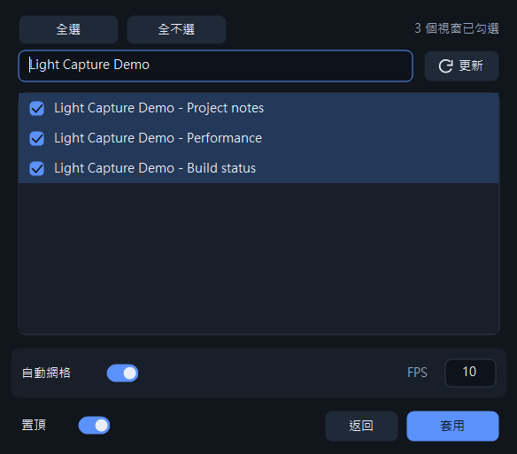
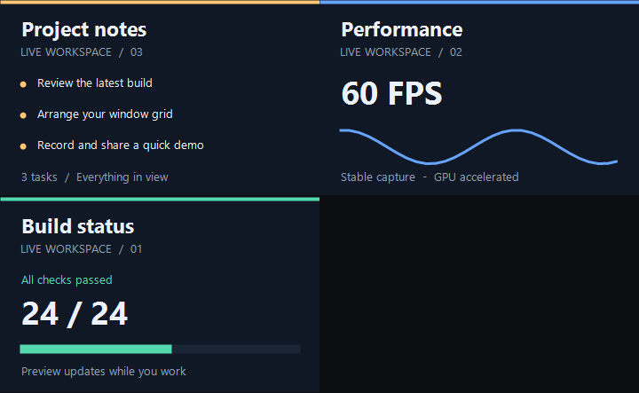
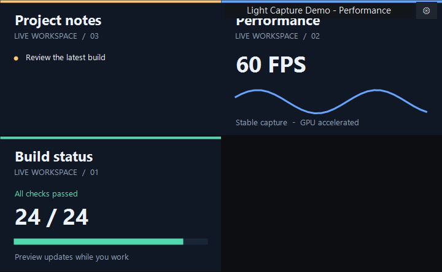

# 視窗監視器

把多個視窗放進同一個網格，即時查看各視窗的畫面。提供 WGC 與 DWM 兩版，操作方式相同。

## 下載

適用 Windows 10 2004 以上／Windows 11，x64。下載單一 EXE 即可執行，不需安裝。

| 版本 | 下載 | 適合用途 |
| --- | --- | --- |
| DWM | [dwm_window_monitor.exe](https://github.com/g114056175/my_tools/releases/download/monitor-v1.0.0/dwm_window_monitor.exe) | 單純查看多個視窗，避免 WGC 的黃色擷取框 |
| WGC（Windows Graphics Capture） | [window_monitor.exe](https://github.com/g114056175/my_tools/releases/download/monitor-v1.0.0/window_monitor.exe) | 希望設定擷取 FPS，或以原始碼延伸影像處理 |

[兩版下載與版本資訊](https://github.com/g114056175/my_tools/releases/tag/monitor-v1.0.0)

## 操作



1. 搜尋並勾選視窗；上方顯示已選數量，提供 **全選／全不選**。單擊切換勾選，`Shift` 可批次更改連續項目。
2. 按「套用」開始預覽。預設自動網格，也可自行指定欄 × 列，最多 24 個來源。
3. 拖曳畫面可交換格位，也能移到空格。滑鼠移入時顯示名稱與設定入口，不會壓縮預覽畫面。
4. 右鍵可切換至來源視窗或移除來源。需要調整來源時，按齒輪返回設定。

本套工具自己的視窗不會列入來源。監視器預設不顯示系統滑鼠游標；兩版均只提供預覽，沒有錄影功能。

| WGC 預覽 | DWM 預覽 |
| --- | --- |
|  |  |

## 兩版差異

「Windows 版」在這裡指 WGC；DWM 同樣是 Windows 提供的功能。

| 項目 | WGC | DWM |
| --- | --- | --- |
| 方式 | Windows Graphics Capture 擷取視窗畫格，再由程式繪製 | Desktop Window Manager 直接呈現即時視窗縮圖 |
| 黃框 | 來源周圍可能出現 Windows 系統擷取框，通常為黃色；隱藏與否受系統版本及權限限制 | 不建立 WGC 擷取工作階段，因此不產生該黃色擷取框 |
| FPS | 可設定 1–60 FPS，控制本工具取得／更新畫格的頻率 | 縮圖更新由 Windows 控制；UI 的 FPS 只影響來源狀態檢查 |
| 負擔 | 需要取得、複製及繪製畫格，來源數量與解析度會影響負擔 | 直接使用系統縮圖，通常較適合輕量預覽；未提供量化效能比較 |
| 影像分析擴充 | 原始碼內有畫格資料，可延伸 OCR 或影像分析；目前沒有提供外部程式介面 | 縮圖 API 不直接交付畫素資料，不能直接拿縮圖句柄交給影像分析程式 |
| 主要限制 | 系統擷取框，以及畫格處理成本 | 無法透過本工具精確控制縮圖 FPS，或直接取得畫格資料 |

來源被其他視窗遮住時仍可預覽；來源最小化可能暫停更新。受保護內容及部分特殊視窗可能顯示黑畫面或無法正常預覽。

實作採用原生 Win32。API 行為參考 Microsoft 的 [WGC 擷取框說明](https://learn.microsoft.com/en-us/uwp/api/windows.graphics.capture.graphicscapturesession.isborderrequired)與 [DWM 即時縮圖說明](https://learn.microsoft.com/en-us/windows/win32/dwm/thumbnail-ovw)。

## 原始碼與建置

`WGC/src/`、`DWM/src/` 各自包含必要原始碼與建置腳本，可獨立編譯。安裝 LLVM-MinGW，將其 `bin` 加入 PATH；在 `monitor/` 執行：

```powershell
powershell -ExecutionPolicy Bypass -File .\WGC\src\build.ps1
powershell -ExecutionPolicy Bypass -File .\DWM\src\build.ps1
```

EXE 分別產生在 `WGC/` 與 `DWM/`。
