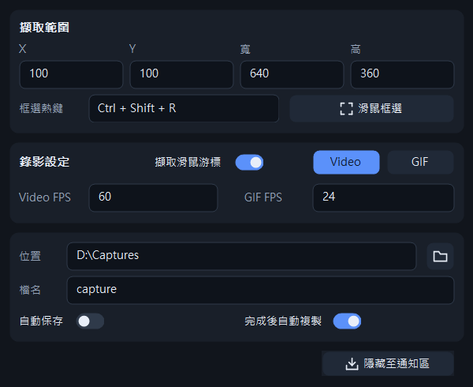
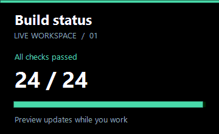

# 區域錄影器

把桌面指定範圍錄成 MP4 或 GIF。

**[下載 region_recorder.exe](https://github.com/g114056175/my_tools/releases/download/region_recorder-v1.0.0/region_recorder.exe)** · [版本資訊](https://github.com/g114056175/my_tools/releases/tag/region_recorder-v1.0.0)

適用 Windows 10 2004 以上／Windows 11，x64。單一 EXE 即可執行，不需安裝；Windows N 版本需先安裝 Media Feature Pack。



1. 設定格式、FPS、保存位置；Video 預設 60 FPS，GIF 預設 24 FPS。
   「擷取滑鼠游標」預設開啟，可關閉；設定會記住，適用 MP4 與 GIF，於開始錄影時套用。
2. 按「滑鼠框選」或 `Ctrl + Shift + R` 拖出範圍，再按 **● 錄製**。
3. 使用 **■ 停止、暫停／繼續、重新框選**；重新框選會先暫停。
4. 停止後保存，或取消保存後直接複製暫存檔。**×** 會清除未保存的錄影；錄製中的 × 會先確認。


`Esc` 可取消初次框選，錄製中不會誤停。快捷鍵可自行設定，錄製流程中會停用重新觸發。
最小化保留工作列；「隱藏至通知區」收起主面板。

錄製限制固定為 **GIF：300 MB／1 分鐘；Video：4 GB／30 分鐘**，任一條件先到即自動停止並進入保存流程。
手動暫停不計時，容量以十進位計算；為了完成檔案收尾，可能略早於容量上限停止。
MP4 使用 H.264 壓縮；GIF 使用 256 色編碼。**目前只錄畫面，不錄系統聲音或麥克風。**

下圖是由本工具實際錄製的 GIF：



採用原生 Win32、Windows Graphics Capture 與 Media Foundation。錄到的是桌面可見內容；其他視窗的遮擋也會錄入。
剪貼簿以檔案方式複製，適用檔案總管及支援檔案貼上的程式。

需要自行編譯時，安裝 LLVM-MinGW 並將其 `bin` 加入 PATH；在 `region_recorder/` 執行：

```powershell
powershell -ExecutionPolicy Bypass -File .\src\build.ps1
```

EXE 產生在 `region_recorder/`。
